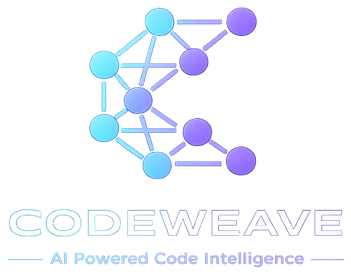
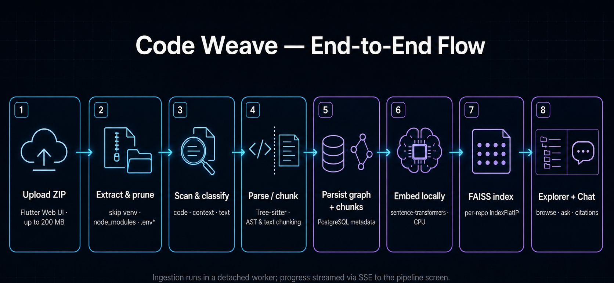

<p align="center">
  
</p>

# Code Weave


**Code Weave helps you understand a software project without reading every file yourself.**

Upload a ZIP of a project (for example, a GitHub repo you downloaded). The app reads the code and documentation, builds a map of how files, classes, and functions fit together, and remembers the important pieces in a searchable index. You can click through that map like a file explorer, see how parts connect, and **ask questions in normal language** — “What does this function do?”, “How is authentication handled?”, “Where is the database configured?” — and get answers grounded in _your_ codebase, with links back to the relevant files.

Think of it as a **smart tour guide for a codebase**: it does not replace reading code for critical changes, but it dramatically speeds up onboarding, exploration, and “where is X implemented?” questions.

### For developers

Code Weave is a full-stack **code intelligence** demo: multi-language parsing (Tree-sitter), structural graphs, dual chunking strategies for RAG, local embeddings, FAISS vector search, and Groq-grounded chat with citations. A **Python / FastAPI** backend owns ingestion and retrieval; a **Flutter Web** client provides upload, live pipeline progress, a collapsible project tree, an architecture graph, and streaming Q&A.


---

## Table of contents

- [What this project demonstrates](#what-this-project-demonstrates)
- [End-to-end flow](#end-to-end-flow)
- [Indexing & RAG pipeline](#indexing--rag-pipeline)
- [Chunking strategies](#chunking-strategies)
- [Query-time RAG (chat)](#query-time-rag-chat)
- [Features](#features)
- [Tech stack](#tech-stack)
- [Project structure](#project-structure)
- [HTTP API](#http-api-summary)
- [Prerequisites](#prerequisites)
- [Setup](#setup)
- [Run](#run)
- [Tests](#tests)
- [Known limitations](#known-limitations)
- [Platform support](#platform-support)
- [License](#license)

---

## What this project demonstrates

| Area                   | What you can evaluate                                                                                                                                                         |
| ---------------------- | ----------------------------------------------------------------------------------------------------------------------------------------------------------------------------- |
| **Code understanding** | Multi-language AST parsing (Tree-sitter), function/class extraction, static call-graph edges                                                                                  |
| **Context ingestion**  | README, requirements, YAML/TOML, Docker, plain text, and unsupported-syntax files (`.css`, `.html`, etc.) indexed alongside code                                              |
| **RAG pipeline**       | Dual chunking (AST semantic + text structural/sliding), local embeddings, FAISS retrieval, custom prompts, Groq streaming — **no LangChain / LlamaIndex / managed vector DB** |
| **Systems design**     | Detached ingestion worker, disk-backed job state, SSE progress, per-repo FAISS indexes with in-memory cache, job resume on API restart                                        |
| **Full-stack UX**      | ZIP upload → live pipeline → collapsible tree + architecture graph → chat with citations, history, and graph highlights                                                       |

---

## End-to-end flow



1. **Upload** — You pick a `.zip` on the home screen (up to **200 MB**). Junk like `venv`, `node_modules`, caches, logs, and `.env*` paths is skipped during extraction and pruned afterward.
2. **Pipeline** — A background worker runs staged ingestion; the UI shows progress (extract → scan → parse → graph → embed → FAISS → done) and navigates to the explorer when finished.
3. **Explore** — Use the **project tree** (expand/collapse subtrees) and the **architecture graph** (same expand state) to browse repository → folder → file → class → function. Select a node to see **What it does**, source code, and call relationships.
4. **Chat** — Ask questions scoped to that repository. The app embeds your question, finds similar chunks in FAISS, loads full text from PostgreSQL, builds a prompt, and streams an answer from Groq with **citations** and optional **graph highlights**.

---

## Indexing & RAG pipeline

Code Weave implements retrieval-augmented generation **from scratch** — no LangChain, LlamaIndex, Pinecone, Chroma, or hosted embedding APIs. The only external AI service for answers is **Groq**; embeddings run **locally** on your machine.

### Ingestion stages

| Stage                  | What happens                                                                                                                                                                            | Main modules                          |
| ---------------------- | --------------------------------------------------------------------------------------------------------------------------------------------------------------------------------------- | ------------------------------------- |
| **ZIP extract**        | Unzip to `backend/data/uploads/`; skip `__MACOSX`, `venv`, `node_modules`, `.git`, caches, logs, `.env*` during read; **prune** leftover junk; enforce **≤ 10,000 files** after cleanup | `zip_extract.py`                      |
| **File scan**          | Walk the tree; classify each file as `code`, `context`, or `text`                                                                                                                       | `source_filter.py`                    |
| **Parse / read**       | Tree-sitter for code; structure-aware or sliding text chunking for docs                                                                                                                 | `process_code.py`, `text_chunking.py` |
| **Graph persist**      | Write files, classes, functions, chunks, call edges to PostgreSQL                                                                                                                       | `persist.py`, `call_extraction.py`    |
| **Embedding**          | Turn each chunk into embedding text (`chunk_text.py`), encode with sentence-transformers                                                                                                | `local_embedder.py`                   |
| **FAISS write**        | L2-normalize vectors; append to per-repo `IndexFlatIP`; store `embedding_index` on chunk rows                                                                                           | `faiss_store.py`, `faiss_cache.py`    |
| **Architecture graph** | Build hierarchy + `calls` edges for the explorer                                                                                                                                        | `build_graph.py`                      |


### Chunking strategies

Every chunk stored in PostgreSQL has a `chunk_strategy` column (`chunk_strategy.py`):

| Strategy            | Value             | When it is used                                                                                                                     |
| ------------------- | ----------------- | ----------------------------------------------------------------------------------------------------------------------------------- |
| **AST semantic**    | `ast_semantic`    | Tree-sitter finds functions, methods, or classes in supported languages — one chunk per logical unit                                |
| **Text structural** | `text_structural` | Docs/config split on meaningful boundaries (Markdown headings, YAML top-level keys, requirements line groups, Docker `FROM` blocks) |
| **Text sliding**    | `text_sliding`    | Fallback for plain text or when structural rules do not apply — overlapping character windows (~2000 chars, ~200 overlap)           |

**Code files (`process_code.py` + `ast_chunking.py`):**

- Parse with Tree-sitter; extract functions/methods and classes where the language spec supports it.
- Deduplicate overlapping chunks (e.g. class body vs. methods inside it).
- If **no** AST chunks are produced, fall back to **text sliding** on the full file source.
- Unsupported extensions (e.g. `.css`, `.html`) are classified as `text` and indexed with an **`indexing_notice`** in the UI.

**Documentation & config (`text_chunking.py`):**

- `context` kind: README, `requirements.txt`, `pyproject.toml`, Dockerfiles, compose YAML, etc.
- `text` kind: `.txt`, `.ini`, `.cfg`, and unsupported-syntax web assets.
- Chunk type for embeddings is usually `document`; embedding text is built as `file: …`, `section: …`, optional `description: …`, then the chunk body.

**Embedding input format (`chunk_to_embedding_text`):**

```
file: src/auth/jwt.py
function: decode_token
description: Validates JWT and returns claims

<source code of the chunk>
```

This structure helps the bi-encoder match natural-language questions to the right symbols.

### Descriptions (“What it does”)

At ingest time, `description_extract.py` pulls docstrings and leading comments. Heuristics improve thin text (e.g. dataclasses, JWT helpers, rate-limit “bucket” functions). If the result is still generic (“This function buckets.”), `summarize_description.py` may call Groq once to rewrite it. Descriptions are shown in the explorer **Details** panel — not a separate “module” or parse-tree section.

### Embeddings & vector store

| Setting    | Default                                    | Notes                                                         |
| ---------- | ------------------------------------------ | ------------------------------------------------------------- |
| Model      | `BAAI/bge-small-en-v1.5`                   | Set via `LOCAL_EMBEDDING_MODEL` in `backend/.env`             |
| Dimension  | 384                                        | `EMBEDDING_DIMENSION` must match the model                    |
| Index type | FAISS `IndexFlatIP`                        | Vectors L2-normalized; inner product ≈ cosine similarity      |
| Storage    | `backend/data/faiss/{repository_id}.index` | One index per repository; in-memory cache in `faiss_cache.py` |
| Metadata   | PostgreSQL `chunks` table                  | `embedding_index` maps FAISS row → chunk row for hydration    |


---

## Query-time RAG (chat)

When you send a chat message:

1. **Embed the query** — Same local model as ingestion (`retrieve_chunks.py`).
2. **FAISS search** — Top-k similar chunk vectors for that repository (default `top_k: 5`).
3. **Hydrate** — Load full chunk text, file path, function name, and scores from PostgreSQL (`lookup.py`).
4. **Prompt** — `prompt.py` builds system + user messages with retrieved context; **beginner mode** uses a tutor-style template and higher temperature.
5. **Generate** — Groq chat API (`groq_client.py`); SSE streams `meta` (citations, highlight node IDs) → `token` → `answer`.
6. **Format** — `format_answer.py` cleans decorative quoting and sections the reply (Summary, How it works, etc.).
7. **Persist** — User and assistant messages saved per repository (`chat/messages.py`).

Orchestration lives in `application/retrieval/rag_service.py`.


**Not used:** LangChain, LlamaIndex, Pinecone, Chroma, Weaviate, or any hosted embedding/vector SaaS.

---

## Features

- **ZIP upload** — Up to **200 MB** (`MAX_UPLOAD_BYTES` in `backend/.env`). Skips/prunes `venv`, `node_modules`, caches, logs, `.env*`, and similar paths; **10,000-file cap** applies after cleanup.
- **Live ingestion pipeline** — SSE progress with a top bar and overlay; stages reflect real work, not decorative steps.
- **Detached worker** — Ingestion in a subprocess so API `--reload` does not kill long jobs; job state in `backend/data/jobs/{job_id}.json` with file locking on Unix (`job_file_lock.py`).
- **Job recovery** — Retry failed jobs when the ZIP still exists; recoverable jobs resume on API startup.
- **Multi-language parsing** — Tree-sitter specs for Python, TypeScript/JavaScript, Java, Go, Rust, C/C++, and more (`language_specs.py`).
- **Three ingest file kinds** — `code` (Tree-sitter), `context` (README, requirements, YAML/TOML, Docker), `text` (plain text + `.css` / `.html` with UI notice).
- **Architecture graph** — Repository → folders → files → classes → functions/methods; `contains` + static `calls` edges; **collapsible subtrees** in both tree and graph views.
- **Explorer UI** — Collapsible project tree, left-to-right architecture canvas, syntax-highlighted source, **What it does** descriptions, indexing notices for text-only files, RAG chat with citations.
- **Progress feedback** — Top progress bar and overlays for upload, delete, repository load, node detail fetch, pipeline, and job retry.
- **RAG chat** — Repository-scoped Q&A, streaming tokens, chunk citations (file, symbol, score), graph highlights, persisted history.
- **Beginner mode** — Simpler language and numbered steps in the chat panel.
- **Repository management** — List, open, delete (DB + FAISS cache + upload artifacts).


---

## Tech stack

| Layer             | Technologies                                       |
| ----------------- | -------------------------------------------------- |
| **API**           | FastAPI, Uvicorn, Pydantic, python-multipart       |
| **Database**      | PostgreSQL, SQLAlchemy 2                           |
| **Parsing**       | Tree-sitter, tree-sitter-languages                 |
| **Embeddings**    | sentence-transformers (local CPU)                  |
| **Vector search** | FAISS (faiss-cpu), per-repo flat index             |
| **LLM**           | Groq API (default: `llama-3.3-70b-versatile`)      |
| **Frontend**      | Flutter Web, Provider, Dio, go_router, file_picker |
| **Highlighting**  | flutter_highlight                                  |
| **Tests**         | pytest (backend), flutter_test (frontend)          |


---

## Project structure

```
code_weave/
├── README.md
├── LICENSE
├── images/                            # README diagrams + branding
│   ├── app-logo.png                   # Master logo (wide; includes padding)
│   ├── app-logo-tight.png             # Trimmed wordmark for README / docs
│   └── app-logo-icon.png              # Square mark for favicon / app bar
├── scripts/
│   ├── setup.sh                       # macOS / Linux bootstrap
│   └── setup.ps1                      # Windows bootstrap (best-effort)
│
├── backend/
│   ├── app/
│   │   ├── server.py                  # FastAPI app · lifespan · CORS · job resume
│   │   └── api/routes/                # upload · jobs · repos · graph · chat · languages
│   ├── application/
│   │   ├── ingestion/                 # ZIP · filter · AST/text chunk · persist · FAISS path
│   │   ├── retrieval/                 # retrieve_chunks · prompt · rag_service · format_answer
│   │   ├── graph/                     # build_graph · node_detail
│   │   ├── chat/                      # Message persistence
│   │   └── repos/                     # Jobs · repository delete · file locks
│   ├── infrastructure/                # db · parser · embeddings · vector · llm · file I/O
│   ├── tests/
│   ├── data/                          # gitignored: uploads · jobs · FAISS
│   ├── ARCHITECTURE.md                # Shorter backend map for contributors
│   ├── .env.example
│   └── requirements.txt
│
└── frontend/
    ├── assets/images/                 # app_logo.png · app_logo_icon.png (trimmed for UI)
    ├── web/                           # favicon · PWA manifest · icons
    └── lib/
        ├── core/brand/ · widgets/     # AppLogo · progress overlays
        └── features/
            ├── home/                  # Repo grid · ZIP upload
            ├── pipeline/              # Ingestion SSE progress
            └── explorer/              # Tree · graph · details · chat
```

**Gitignored runtime paths:** `backend/.env`, `backend/data/`, `backend/logs/`, `backend/venv/`, `frontend/build/`.

---

## HTTP API (summary)

| Method   | Path                                   | Purpose                                                   |
| -------- | -------------------------------------- | --------------------------------------------------------- |
| `GET`    | `/api/health`                          | Liveness                                                  |
| `GET`    | `/api/repositories`                    | List indexed repositories                                 |
| `GET`    | `/api/repositories/{id}`               | Repository metadata                                       |
| `DELETE` | `/api/repositories/{id}`               | Delete repo + FAISS + uploads                             |
| `POST`   | `/api/repositories/upload`             | Upload ZIP, start ingestion job                           |
| `GET`    | `/api/jobs/{id}`                       | Job snapshot                                              |
| `GET`    | `/api/jobs/{id}/events`                | SSE progress stream                                       |
| `POST`   | `/api/jobs/{id}/retry`                 | Retry failed job (if ZIP still on disk)                   |
| `GET`    | `/api/languages/supported`             | Supported Tree-sitter languages                           |
| `GET`    | `/api/repositories/{id}/hierarchy`     | Explorer tree nodes                                       |
| `GET`    | `/api/repositories/{id}/graph`         | Architecture nodes + edges                                |
| `GET`    | `/api/nodes/{node_id}`                 | Node detail (code, description, calls, indexing metadata) |
| `GET`    | `/api/repositories/{id}/chat/messages` | Chat history                                              |
| `POST`   | `/api/repositories/{id}/chat`          | Streaming RAG (SSE: `meta` → `token` → `answer` → `done`) |
| `POST`   | `/api/repositories/{id}/chat/sync`     | Non-streaming RAG                                         |

**Chat request body:**

```json
{
  "query": "What does the ingestion pipeline do?",
  "top_k": 5,
  "beginner_mode": false
}
```

Interactive docs: [http://127.0.0.1:8000/docs](http://127.0.0.1:8000/docs)

---

## Prerequisites

- **Python 3.11+**
- **PostgreSQL** (local or remote)
- **Flutter SDK** (Web target; Chrome recommended)
- **Groq API key** — [console.groq.com](https://console.groq.com)

The first embedding run downloads the Hugging Face model (~tens of MB). Allow a few minutes on a slow connection.

---

## Setup

```bash
cd code_weave
./scripts/setup.sh
```

`setup.sh` creates `backend/venv`, installs Python dependencies, copies `backend/.env.example` → `backend/.env` if missing, bootstraps the database schema, verifies Tree-sitter, and runs `flutter pub get` when Flutter is on `PATH`.

**Configure `backend/.env`:**

```env
DB_HOST=localhost
DB_PORT=5432
DB_NAME=code_weave
DB_USER=your_user
DB_PASSWORD=your_password
GROQ_API_KEY=your_groq_key
```

See `backend/.env.example` for embedding model, CORS, and `MAX_UPLOAD_BYTES` (default 200 MB).

**Windows:** run `scripts/setup.ps1` from PowerShell. See [Platform support](#platform-support).

---

## Run

**Terminal 1 — API**

```bash
cd backend
source venv/bin/activate
PYTHONPATH=. uvicorn app.server:app --reload --reload-exclude 'data/**' --host 0.0.0.0 --port 8000
```

Use `data/**` (not `data/*`) so files under `backend/data/` do not trigger reload loops during uploads and job writes.

**Terminal 2 — Web UI**

```bash
cd frontend
flutter run -d chrome --dart-define=API_BASE_URL=http://127.0.0.1:8000
```

After changing assets (e.g. logo), do a **full restart** of `flutter run`, not only hot reload.

**Suggested demo flow**

1. Open the app → **Upload repository** (include a `README.md` and Python or TypeScript source for best results).
2. Watch the **pipeline** until indexing completes (auto-navigates to explorer).
3. In **Explorer**: expand/collapse folders in the **project tree** or **architecture graph**; select a function; read **What it does** and source in **Details**.
4. In **Chat**, ask about code or setup; toggle **Beginner mode** to compare answer styles. Citations and graph highlights appear in the response.

**Re-ingest** repositories that were indexed before newer description or chunking improvements if you want updated metadata.

---

## Tests

```bash
# Backend
cd backend && source venv/bin/activate
PYTHONPATH=. pytest -q

# Frontend
cd frontend && flutter test
```

Backend tests cover API health/CORS, upload and ZIP extraction (including prune limits), jobs, chat/RAG, chunk strategies, AST and text chunking, descriptions, FAISS, graph APIs, and repository deletion. Frontend tests cover graph layout, visibility helpers, providers, and widgets.

---

## Known limitations

This project is a **local demo / portfolio system**, not production-hardened.

| Limitation | Why |
| ---------- | --- |
| **FAISS `IndexFlatIP`** | Exact brute-force search; simple and correct for small indexes. At larger scale, I might consider IVF/HNSW or pgvector. |
| **Global ingestion lock** | One ingestion job per API host. Multi-machine deployments would need a queue and dedicated workers. |
| **No auth** | Upload, delete, and chat are open on the API. Production use would need API keys and per-repo access control. |
| **Static call graph** | Tree-sitter name heuristics, not full type analysis — useful for navigation, not sound program analysis. |
| **Context chunks + `function_id` FK** | Documentation chunks attach to synthetic function rows; a nullable `function_id` or dedicated section entity would scale better. |

---

## Platform support

**Code Weave was built and tested primarily on macOS.** Linux generally works with the same `setup.sh` flow.

**Windows may break or behave differently** — path handling, detached subprocess ingestion, and job file locking (`fcntl` is Unix-only) are the usual pain points. `scripts/setup.ps1` is provided as a best-effort bootstrap; treat Windows support as experimental and report issues if you need it first-class.

---

## License

Copyright © 2026 Rikin Ranka

Licensed under the [Apache License, Version 2.0](LICENSE). You may use, modify, and distribute this project (including for your own similar work), provided you include a copy of the license and state significant changes. See [LICENSE](LICENSE) for the full terms.
