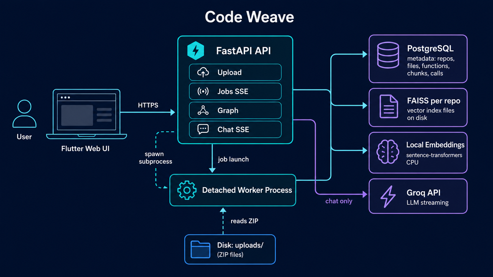
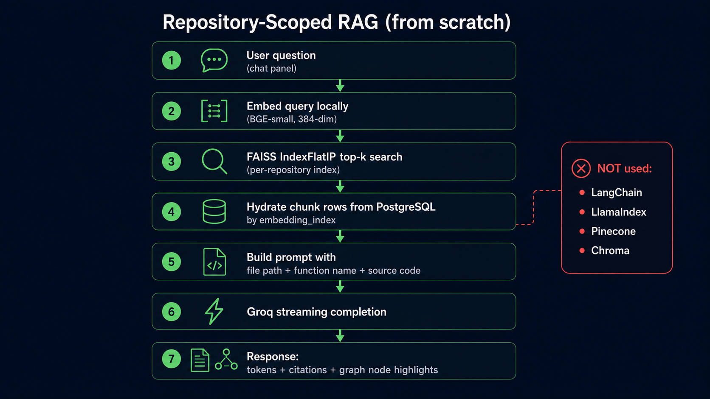
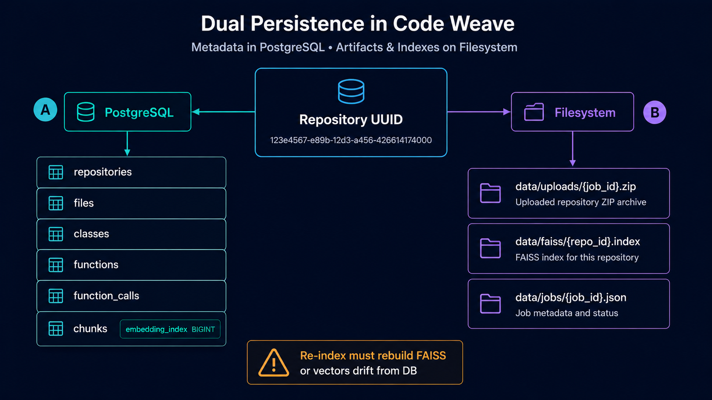
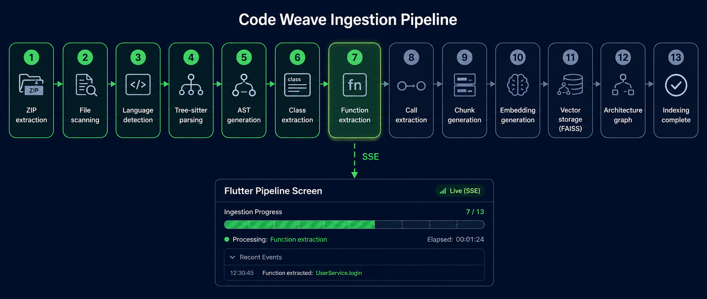
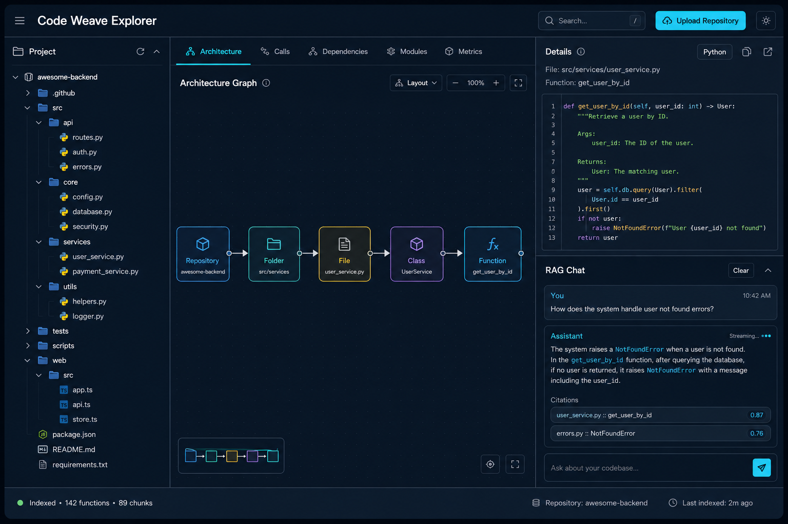
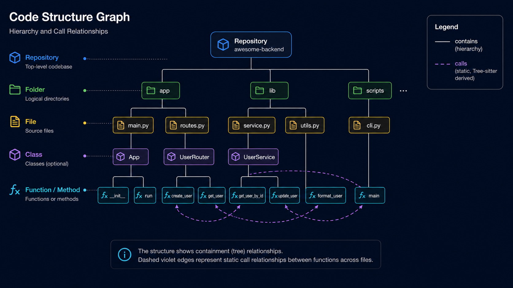
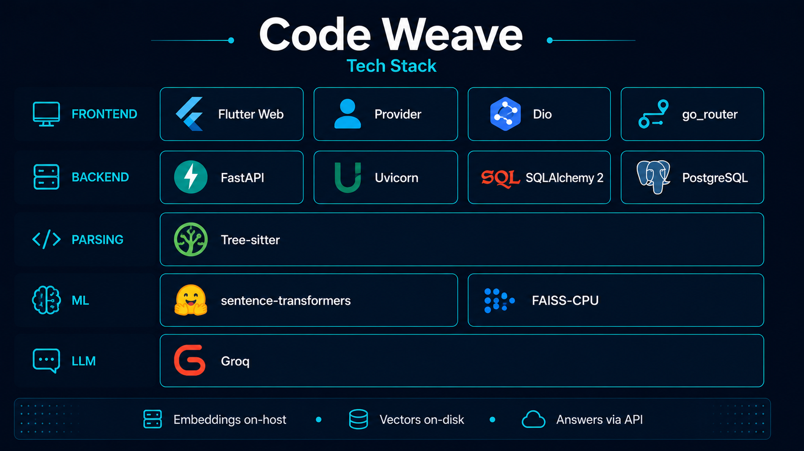

# Code Weave

**Upload a codebase as a ZIP, index source code and documentation, explore it through an interactive architecture graph, and ask questions with repository-scoped RAG chat.**

Code Weave is a full-stack project built for demonstrating end-to-end code intelligence: parsing, structural graph extraction, documentation indexing, local embeddings, vector search, and LLM-grounded answers with citations. A Python/FastAPI backend owns ingestion and retrieval; a Flutter Web client provides upload, live pipeline progress, a VS Code–style explorer, and streaming Q&A.



---

## What this project demonstrates

| Area | What you can evaluate |
|------|------------------------|
| **Code understanding** | Multi-language AST parsing (Tree-sitter), function/class extraction, static call-graph edges |
| **Context ingestion** | README, requirements, YAML/TOML, Docker, and other config/docs indexed alongside code for richer RAG answers |
| **RAG pipeline** | Custom chunking (AST + text), local embeddings, FAISS retrieval, prompt assembly, Groq streaming — **no LangChain / LlamaIndex / managed vector DB** |
| **Systems design** | Detached ingestion worker, disk-backed job state, SSE progress, per-repo FAISS indexes |
| **Full-stack UX** | ZIP upload → live pipeline → explorer tree + architecture graph → chat with citations, history, and graph highlights |

---

## RAG built from scratch

The retrieval stack is implemented in-house rather than delegated to a framework:

| Component | Implementation |
|-----------|----------------|
| **Chunking (code)** | One chunk per extracted function/method via Tree-sitter; embedding text = `file + function name + description (if any) + source` |
| **Chunking (docs/config)** | Text-based sections for README (`.md`), requirements (`requirements.txt`, `Pipfile`), YAML/TOML, Dockerfiles, and `docker-compose*.yml` (`application/ingestion/process_context.py`); embedding text uses `section:` instead of `function:` |
| **Embeddings** | `sentence-transformers` via a thin wrapper (`infrastructure/embeddings/local_embedder.py`); default model `BAAI/bge-small-en-v1.5` (384-dim) |
| **Vector store** | Per-repository **FAISS** `IndexFlatIP` with L2-normalized vectors (`infrastructure/vector/faiss_store.py`) |
| **Metadata** | Chunk rows + `embedding_index` in **PostgreSQL** for lookup after FAISS search |
| **Retrieval** | Query embed → FAISS top-k → hydrate chunks from DB (`application/retrieval/retrieve_chunks.py`) |
| **Generation** | Structured system/user prompts from retrieved context (`application/retrieval/prompt.py`) → **Groq** chat API (streaming SSE) → post-processed for clean, sectioned answers (`application/retrieval/format_answer.py`) |

**Not used:** LangChain, LlamaIndex, Pinecone, Chroma, Weaviate, or any hosted embedding/vector SaaS. The only external AI dependency for answers is Groq; embeddings run entirely on the host.





---

## Features

- **ZIP upload** — Upload a repository archive; size limit configurable (`MAX_UPLOAD_BYTES`, default 100 MB).
- **Live ingestion pipeline** — Staged progress (extract → scan → parse/read → embed → graph) streamed over SSE; UI auto-navigates to explorer on success.
- **Detached worker** — Ingestion runs in a subprocess so API hot-reload does not kill long jobs; progress persisted to `backend/data/jobs/{job_id}.json`.
- **Multi-language parsing** — Tree-sitter with per-language query specs (Python, TypeScript/JavaScript, Java, Go, Rust, C/C++, and more).
- **Documentation & config indexing** — README, requirements, YAML/TOML, Docker, and compose files are chunked and embedded for retrieval (lock files, `.env*`, and vendor dirs remain excluded).
- **Architecture graph** — Nodes: repository → folders → files → classes → functions/methods. Edges: `contains` (hierarchy) + `calls` (static call graph).
- **Explorer UI** — Project tree, left-to-right architecture canvas, syntax-highlighted node details with **What it does** descriptions, RAG chat panel.
- **RAG chat** — Repository-scoped Q&A with structured answers (Summary, How it works, Relevant chunks), streaming tokens, chunk citations (file, function/section, score), and optional graph node highlights.
- **Chat history** — Messages persisted per repository in PostgreSQL; explorer reloads prior Q&A when you reopen a repo.
- **Beginner mode** — Toggle in the chat panel for tutor-style explanations: simpler language, numbered steps, higher LLM temperature, and a distinct prompt format (Summary / Steps / Key idea).
- **Node descriptions** — Docstrings and file/class comments extracted at ingest time and stored in PostgreSQL (`description` on files, classes, functions); shown in the node details panel.
- **Repository management** — List, inspect, delete indexed repos (DB + FAISS + upload artifacts).







---

## Tech stack

| Layer | Technologies |
|-------|----------------|
| **API** | FastAPI, Uvicorn, Pydantic, python-multipart |
| **Database** | PostgreSQL, SQLAlchemy 2 |
| **Parsing** | Tree-sitter, tree-sitter-languages |
| **Embeddings** | sentence-transformers (local CPU) |
| **Vector search** | FAISS (faiss-cpu), per-repo flat index |
| **LLM** | Groq API (default: `llama-3.3-70b-versatile`) |
| **Frontend** | Flutter Web, Provider, Dio, go_router |
| **Highlighting** | flutter_highlight |
| **Tests** | pytest (backend), flutter_test (frontend) |



---

## Project structure

```
code_weave/
├── README.md                          # This file
├── images/                            # Diagrams for this README
├── scripts/
│   ├── setup.sh                       # macOS/Linux bootstrap
│   └── setup.ps1                      # Windows bootstrap
│
├── backend/
│   ├── app/                           # HTTP layer
│   │   ├── server.py                  # FastAPI app · lifespan · CORS
│   │   ├── main.py                    # CLI entry (legacy index helpers)
│   │   └── api/
│   │       ├── deps.py
│   │       ├── routes/                # upload · jobs · repos · graph · chat
│   │       └── schemas/
│   │
│   ├── application/                   # Domain logic
│   │   ├── ingestion/
│   │   │   ├── zip_extract.py         # Safe ZIP extraction
│   │   │   ├── source_filter.py       # Code vs context file classification
│   │   │   ├── process_code.py        # Tree-sitter · functions · calls
│   │   │   ├── process_context.py     # Text chunking for docs/config
│   │   │   ├── description_extract.py # Docstrings · comments → description
│   │   │   ├── chunk_text.py          # Chunk → embedding string
│   │   │   ├── index_folder.py        # Orchestrate parse → persist → FAISS
│   │   │   ├── persist.py             # SQLAlchemy batch writes
│   │   │   ├── pipeline_runner.py     # Staged job orchestration
│   │   │   ├── job_launcher.py        # Detached subprocess spawn
│   │   │   └── worker.py              # Worker entrypoint
│   │   ├── chat/
│   │   │   └── messages.py            # Persist · list chat history
│   │   ├── retrieval/
│   │   │   ├── retrieve_chunks.py     # Embed · FAISS · DB hydrate
│   │   │   ├── prompt.py              # RAG message builder · beginner mode
│   │   │   ├── format_answer.py       # Strip decorative quotes · tidy output
│   │   │   └── query_repository.py    # Sync RAG helper
│   │   ├── graph/
│   │   │   ├── build_graph.py         # Hierarchy + call edges
│   │   │   └── node_detail.py         # Source · description · calls for a node
│   │   └── repos/
│   │       ├── processing_tracker.py  # Job state · disk JSON
│   │       └── repository_service.py
│   │
│   ├── infrastructure/                # Adapters
│   │   ├── db/                        # Models · session · bootstrap
│   │   ├── parser/                    # tree_sitter_parser · language_specs
│   │   ├── embeddings/                # local_embedder · config
│   │   ├── vector/                    # FaissStore · per-repo paths
│   │   └── llm/                       # groq_client
│   │
│   ├── tests/                         # pytest
│   ├── data/                          # gitignored: uploads · jobs · FAISS
│   ├── .env.example
│   └── requirements.txt
│
└── frontend/
    └── lib/
        ├── main.dart
        ├── core/
        │   ├── config/api_config.dart
        │   ├── network/               # Dio client · SSE parser
        │   ├── router/app_router.dart # / · /pipeline/:id · /explorer/:id
        │   ├── theme/
        │   └── layout/
        └── features/
            ├── home/                  # Repo grid · ZIP picker
            ├── pipeline/              # Ingestion progress (SSE)
            └── explorer/              # Tree · graph canvas · details · chat
                └── presentation/widgets/
                    ├── rag_chat_panel.dart
                    └── structured_chat_text.dart  # Sectioned chat rendering
```

**Gitignored runtime paths:** `backend/.env`, `backend/data/`, `backend/logs/`, `backend/venv/`, `frontend/build/`.

---

## HTTP API (summary)

| Method | Path | Purpose |
|--------|------|---------|
| `GET` | `/api/health` | Liveness |
| `GET` | `/api/repositories` | List indexed repositories |
| `GET` | `/api/repositories/{id}` | Repository metadata |
| `DELETE` | `/api/repositories/{id}` | Delete repo + FAISS + uploads |
| `POST` | `/api/repositories/upload` | Upload ZIP, start ingestion job |
| `GET` | `/api/jobs/{id}` | Job snapshot |
| `GET` | `/api/jobs/{id}/events` | SSE progress stream |
| `POST` | `/api/jobs/{id}/retry` | Retry failed job (if ZIP still on disk) |
| `GET` | `/api/languages/supported` | Supported Tree-sitter languages |
| `GET` | `/api/repositories/{id}/hierarchy` | Explorer tree nodes |
| `GET` | `/api/repositories/{id}/graph` | Architecture nodes + edges |
| `GET` | `/api/nodes/{node_id}` | Node detail (code, description, calls, metadata) |
| `GET` | `/api/repositories/{id}/chat/messages` | Chat history for a repository |
| `POST` | `/api/repositories/{id}/chat` | Streaming RAG (SSE: `meta` → `token` → `answer` → `done`) |
| `POST` | `/api/repositories/{id}/chat/sync` | Non-streaming RAG |

**Chat request body** (`POST .../chat` and `.../chat/sync`):

```json
{
  "query": "What does the ingestion pipeline do?",
  "top_k": 5,
  "beginner_mode": false
}
```

Set `beginner_mode: true` for tutor-style numbered steps and simpler language.

Interactive docs: [http://127.0.0.1:8000/docs](http://127.0.0.1:8000/docs)

---

## Prerequisites

- **Python 3.11+**
- **PostgreSQL** (local or remote)
- **Flutter SDK** (Web target; Chrome)
- **Groq API key** — [console.groq.com](https://console.groq.com)

The first embedding run downloads the Hugging Face model (~tens of MB). Allow a few minutes on a slow connection.

---

## Setup

```bash
cd code_weave
./scripts/setup.sh
```

`setup.sh` creates `backend/venv`, installs Python dependencies, copies `backend/.env.example` → `backend/.env` if missing, bootstraps the database schema, and runs `flutter pub get` when Flutter is on `PATH`.

**Configure `backend/.env`:**

```env
DB_HOST=localhost
DB_PORT=5432
DB_NAME=code_weave
DB_USER=your_user
DB_PASSWORD=your_password
GROQ_API_KEY=your_groq_key
```

See `backend/.env.example` for embedding model, CORS, and upload limits.

**Windows:** run `scripts/setup.ps1` from PowerShell.

---

## Run

**Terminal 1 — API**

```bash
cd backend
source venv/bin/activate
PYTHONPATH=. uvicorn app.server:app --reload --reload-exclude 'data/**' --host 0.0.0.0 --port 8000
```

Use `data/**` (not `data/*`) so files under `backend/data/` do not trigger reload loops during uploads and job writes.

**Terminal 2 — Web UI**

```bash
cd frontend
flutter run -d chrome --dart-define=API_BASE_URL=http://127.0.0.1:8000
```

**Suggested demo flow**

1. Open the app → **Upload repository** (include a `README.md` and Python or TypeScript source for best results).  
2. Watch the **pipeline** until indexing completes (auto-navigates to explorer). The scan stage reports code and context file counts.  
3. In **Explorer**: browse the tree, open the **Architecture** tab, select a function, view **Details** — declared file, **What it does** (from extracted docstrings), references, and source code.  
4. In **Chat**, ask about code ("What does X do?") or setup ("How do I install dependencies?"). Toggle **Beginner mode** to compare tutor-style vs developer-style answers. Citations and graph highlights appear in the response; history persists when you return to the repo.

**Note:** Node descriptions and documentation chunks are populated during ingestion. Re-upload or re-ingest a repository to backfill content for repos indexed before these features were added.

---

## Tests

```bash
# Backend
cd backend && source venv/bin/activate
PYTHONPATH=. pytest -q

# Frontend
cd frontend && flutter test
```

Backend tests cover health/CORS, upload/ZIP extraction, job launcher, processing tracker, progress API, chat API, chat message persistence, RAG prompts, answer formatting, description extraction, context file ingestion, source filtering, path utilities, node detail, and repository deletion.

---

## License

Copyright © 2026 Rikin Ranka

Licensed under the [Apache License, Version 2.0](LICENSE). You may use, modify, and distribute this project (including for your own similar work), provided you include a copy of the license and state significant changes. See [LICENSE](LICENSE) for the full terms.
